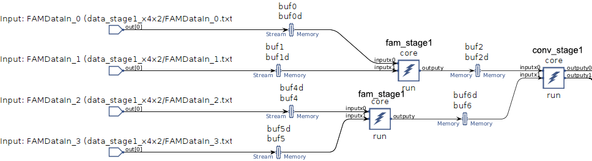

# Build the Design


```
make all
```


## AI Engine Design

The following AI Engine features are used in this design:

* single precision floating-point compute of the FAM alogorithms 
* 134 tile design with 128 parallel accelerators
* 1:128 broadcast stream
* PL Kernels designed to support data move in AI Engine

## Stage1 Graph

### **FAM Stage 1 Processing (fam_stage1() kernel)**
Review the `kernels/fam_stage1.cpp` file.
- The `fam_stage1` function processes complex floating-point (cfloat) input data.
- It applies a **256-point FFT** to chunks of 256 complex numbers.
- The function performs **windowing**, **256-pt FFT**, **Downconversion**, and **matrix transposition**.
- It processes two input buffers (`inputx0` and `inputx1`) and generates a single output buffer (`outputy`).
- The function operates in a **block-based loop**, iterating over four data blocks for each input buffer.

### **CONV Processing (conv_stage1() kernel)**
Review the `kernels/conv_stage1.cpp` file.
- The `conv_stage1` function takes two **2048-element complex input buffers**.
- It writes the input data to two output streams (`outputy0` and `outputy1`).
- The function uses **pipelined loop processing** to efficiently stream data.
- Data is written incrementally in chunks of four complex elements per iteration.


- **Input (`FAMDataIn_x`)**: These correspond to the input files fed into the **FAM stage**.
- **FAM processing (`fam_stage1`)**: The first computational stage processes the data using FFT-based accumulation.
- **Memory buffer**: Intermediate results are stored in **buffer** and then passed to the **CONV stage**.
- **CONV processing (`conv_stage1`)**: The second computational stage streams the processed data to the output.
- **Final output**: The data is finally written to the output stream.


## Stage2 Graph

### **FAM Stage 2 Processing (fam_stage2() kernel)**
<div align="center">
    
</div>

Review the `kernels/fam_stage2.cpp` file.
- The `fam_stage2` function processes **complex floating point (cfloat) input streams** from two input sources (`inputx0`, `inputx1`).
- The function reads **16-element vectorized complex numbers** from the input stream.
- It uses the `stage2_cm` function to compute the result after conjugate multiplication.
- A **32-point FFT (`FFT_32pt`)** is performed on the data after conjugate multiplication.
- The transformed data is written to the output stream (`outputy`).


## Design Overview
The figure below shows block diagram of the FAM algorithm. It may be described as follows:
* The "front-end" compute consists of 4 `fam_stage1()` kernel and 2 `conv_stage1()` kernel . 

- 4 `fam_stage1` processing units (`fam_stage1_0` ~ `fam_stage1_3`) preprocess the data, such as **windowing, 256-pt FFT, Downconversion**, etc. `conv_stage1_0` and `conv_stage1_1` are responsible for merging the data streams and preparing the data to be transferred to **FAM Stage 2** for further processing.


- We use a special method to handle the transposition of the matrix, please refer to the `kernels/conv_stage1.cpp` file for detailed description

- The "back-end" compute consists of 32 identical instances of a `fam_stage2()` kernel . 

- There are 128 `fam_stage2` processing units (`fam_stage2_0` ~ `fam_stage2_127`). Each `fam_stage2` processing unit performs **32-point FFT** and **Conjugate Multiplication**.
<div align="center">
    
</div>


### AI Engine Array View
The diagram below shows the floor plan view of the AI Engine array. The design requires resources from a $134$ rectangular region of the array. The nine leftmost and rightmost array columns are left unused in this case. 

<div align="center">
    
</div>

## (Optional) Detailed code explanation of each stage 
In this section, I will explain in detail my thinking when designing each piece of code. In order to simplify the process, I used methods including pipelining, parallelization, and pre-calculation of parameters to improve efficiency.
Review the `inc/fam_funcs.h` file.

### Windowing
```
inline __attribute__((always_inline)) void window_fam (cfloat * restrict px0,  cfloat * restrict py0)
{   
    //static constexpr float* __restrict tw1 = (float*)window_factor;
    v8float * restrict ptw1 = (v8float * restrict) window_factor1;
    //v8float * restrict ptw2 = (v8float * restrict) (window_factor1 + 32/2);
    v8float * restrict pi1 = (v8float * restrict) px0;
    //v8float * restrict pi2 = (v8float * restrict) px0 + 32/2;
    v8float * restrict po1 = (v8float * restrict) py0;
    //v8float * restrict po2 = (v8float * restrict) py0 + 32/2;
    for (int j = 0; j < 32; ++j)  
        chess_prepare_for_pipelining chess_flatten_loop
    {       
        v8float x1 = *pi1++;
        v8float x2 = *pi1++;      
        v8float coef1 = *ptw1++;
        v8float coef2 = *ptw1++;              
        *po1++ = fpmul(x1, coef1);
        *po1++ = fpmul(x2, coef2);        
    }
}
```

## Next Steps

After compiling the 100 compute unit N-Body Simulator design, you are ready to create the PL datamover kernels in the next module, [Module 03 - PL Design](../Module_03_pl).

