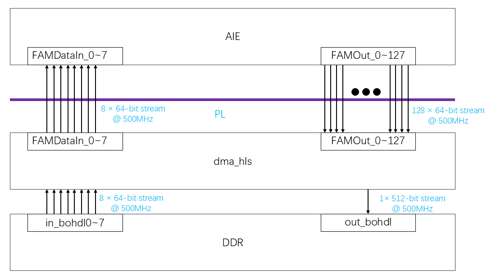

## **Block Diagram**
The following diagram illustrates the **high-throughput dataflow** between DDR, PL, and AI Engine:

<div align="center">
    
</div>

- **Input:** `8 × 64-bit` streams at **500MHz**.
- **Processing:** FFT Accumulation expands the data into `128 × 64-bit` streams at **500MHz**.
- **Output:** Processed data is packed into `1 × 512-bit` stream at **500MHz** and written to DDR.


## **Connectivity Configuration**
The following **`config.cfg`** file ensures proper **stream connections** between **DMA HLS and AI Engine**:

```ini
[connectivity]
nk=dma_hls:1:dma_hls_0

stream_connect=dma_hls_0.FAMDataIn_0:ai_engine_0.FAMDataIn_0
stream_connect=dma_hls_0.FAMDataIn_1:ai_engine_0.FAMDataIn_1
...
stream_connect=ai_engine_0.FAMOut_127:dma_hls_0.FAMOut_127

sp=dma_hls_0.memin0:MC_NOC0
sp=dma_hls_0.memout:MC_NOC0
```
- **Streams connect** `dma_hls` and `ai_engine` through **AXI streams**.
- **Memory mapped to NoC (`MC_NOC0`)** for optimized DDR bandwidth.

---