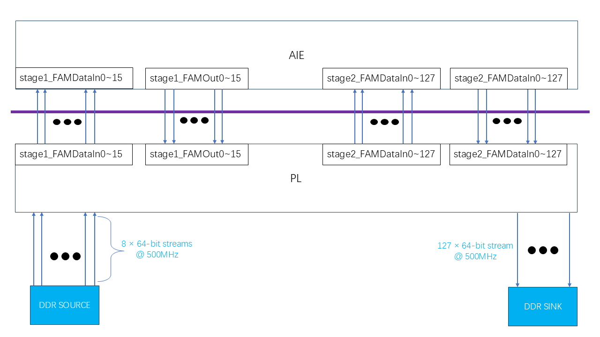

# Build the Design


```
make all
```


## AI Engine Design

The following AI Engine features are used in this design:

* single precision floating-point compute of the FAM alogorithms 
* 128 tile design with 128 parallel accelerators
* PL Kernels designed to support data move in AI Engine

## Stage1 Graph

### **FAM Stage 1 Processing (fam_stage1() kernel)**
<div align="center">
    
</div>

Review the `kernels/fam_stage1.cpp` file.
- The `fam_stage1` function processes complex floating-point (cfloat) input data.
- It applies a **256-point FFT** to chunks of 256 complex numbers.
- The function performs **windowing**, **256-pt FFT**, **Downconversion**, and **matrix transposition**.
- It processes one input buffers (`inputx0`) and generates a single output buffer (`outputy`).
- The function operates in a **block-based loop**, iterating over four data blocks for a input buffer.


## Stage2 Graph

### **FAM Stage 2 Processing (fam_stage2() kernel)**
<div align="center">
    
</div>

Review the `kernels/fam_stage2.cpp` file.
- The `fam_stage2` function processes **complex floating point (cfloat) input streams** from one input sources (`inputx0`).
- The function reads **16-element vectorized complex numbers** from the input stream.
- It uses the `stage2_cm` function to compute the result after conjugate multiplication.
- A **32-point FFT (`FFT_32pt`)** is performed on the data after conjugate multiplication.
- The transformed data is written to the output stream (`outputy`).


## Design Overview
The figure below shows block diagram of the FAM algorithm. It may be described as follows:
1. **Data is read from DDR and transferred to AIE (stage 1)**
- The code defines the `readDDR_to_AIE1()` function to read 64-bit data from multiple DDR memory blocks (`memin0` to `memin15`) and write it to the input stream of AIE stage1 (`stage1_FAMDataIn_x`) through AXI-Stream.
- `#pragma HLS PIPELINE II=1` is used to ensure that data can be efficiently pipelined and improve throughput.

2. **Data is output from AIE (stage 1) and stored in the DDR intermediate buffer (`memtrans`)**
- `readAIE1_to_memtrans()` reads the output stream of AIE stage1 and stores it in the intermediate buffer (`memtrans`).
- Here, `#pragma HLS UNROLL factor=4` is used to increase parallelism and speed up data access.

3. **Read data from intermediate buffer (`memtrans`) and transfer to AIE (stage 2)**
- `plTranspose_to_aie2()` rearranges `memtrans` data and writes to the input stream of AIE stage2 (`stage2_FAMDataIn_x`).
- The code uses `HLS PIPELINE` and `UNROLL` to further optimize data transfer efficiency.

4. **Read data from AIE (stage 2) and write back to DDR**
- `aie2_to_ddr()` reads the output stream of AIE stage2 (`stage2_FAMOut_x`), reassembles it into 512-bit data blocks, and finally writes `memout` to store in DDR.
- Use `#pragma HLS PIPELINE II=1` to ensure that data can be stored in memory efficiently.

<div align="center">
    
</div>


### AI Engine Array View
The diagram below shows the floor plan view of the AI Engine array. The design requires resources from a $134$ rectangular region of the array. The nine leftmost and rightmost array columns are left unused in this case. 

<div align="center">
    
</div>

## (Optional) Detailed code explanation of each stage 
In this section, I will explain in detail my thinking when designing each piece of code. In order to simplify the process, I used methods including pipelining, parallelization, and pre-calculation of parameters to improve efficiency.

Review the `inc/fam_funcs.h` file.

### I.Windowing
```
inline __attribute__((always_inline)) void window_fam (cfloat * restrict px0,  cfloat * restrict py0)
{   
    //static constexpr float* __restrict tw1 = (float*)window_factor;
    v8float * restrict ptw1 = (v8float * restrict) window_factor1;
    //v8float * restrict ptw2 = (v8float * restrict) (window_factor1 + 32/2);
    v8float * restrict pi1 = (v8float * restrict) px0;
    //v8float * restrict pi2 = (v8float * restrict) px0 + 32/2;
    v8float * restrict po1 = (v8float * restrict) py0;
    //v8float * restrict po2 = (v8float * restrict) py0 + 32/2;
    for (int j = 0; j < 32; ++j)  
        chess_prepare_for_pipelining chess_flatten_loop
    {       
        v8float x1 = *pi1++;
        v8float x2 = *pi1++;      
        v8float coef1 = *ptw1++;
        v8float coef2 = *ptw1++;              
        *po1++ = fpmul(x1, coef1);
        *po1++ = fpmul(x2, coef2);        
    }
}
```
- `x1` and `x2` read 8 sets of float data from input array `px0` respectively.
- `coef1` and `coef2` read 8 sets of window factors from window coefficient array `window_factor1`**.
- Then use `fpmul` to calculate window weighted values and store them in `po1`.
- It should be noted that we save window coefficient array `window_factor1` in `inc/parameters.h` file.

### II.256-pt FFT
Please refer to the `FFT_256pt` and `opt_cfloat_stage_256pt` functions in the `inc/fam_funcs.h` file. We actually call the `aie::fft_dit` class template in the [AIE API](https://www.xilinx.com/htmldocs/xilinx2023_1/aiengine_api/aie_api/doc/group__group__fft.html).

`FFT_256pt` function uses predefined rotation factor lookup table (`tw_table`) to store the rotation factors (twiddle factors) required for FFT calculation.
And call `opt_cfloat_stage_256pt()` 8 times to perform Radix-2 FFT transformation.
Then swap the first 128 points and the last 128 points of the output data to achieve **spectral rearrangement** (move the DC component to the center). `opt_cfloat_stage_256pt()` calls `aie::fft_dit` for Radix-2 FFT calculation. After the calculation is completed, swap the buffer (`pingPong = 1 - pingPong`) to prepare for the next level of FFT calculation.


### III.Downconversion
The complex exponential can be expressed as

$$
e^{-\frac{j2\pi kmL}{N'}} \quad (1)
$$

Here, `m` is the Row index, `k` is the Column index, `N'` is 256, and `L` is 64.

We found that the resulting complex exponential array is periodic, as follows:

The matrix exhibits a 4-column cyclic structure, meaning only the first 4 columns are unique, and the rest are repetitions.
The matrix exhibits a 4-row cyclic structure, meaning only the first 4 rows of each column are unique, and the remaining rows are repetitions.
This means that the matrix can be represented using a 4 × 4 fundamental block that repeats across the entire 256 × 32 structure.

Therefore, in the `inc/parameters.h` file, we define four arrays `cfloat dc_coef1~4` to simplify the calculation.

```
inline __attribute__((always_inline)) void stage1_dc (cfloat * restrict px0, unsigned int index,  cfloat * restrict py0)
{         
    v4cfloat * restrict ptw;    
    switch (index) {
    case 0:
        ptw = (v4cfloat * restrict) dc_coef1;
        break;
    case 1: 
        ptw = (v4cfloat * restrict) dc_coef2;
        break;
    case 2: 
        ptw = (v4cfloat * restrict) dc_coef3;
        break;
    case 3: 
        ptw = (v4cfloat * restrict) dc_coef4;
        break;
    default:
        return;  
    }  
    v4cfloat * restrict pi = (v4cfloat * restrict) px0;
    v4cfloat * restrict po = (v4cfloat * restrict) py0;   
    v4cfloat coef = *ptw;    
    for (int j = 0; j < 32 ; ++j)  
        chess_prepare_for_pipelining chess_flatten_loop
    {      
        v4cfloat x1 = *pi++;
        v4cfloat x2 = *pi++;                  
        *po++ = fpmul(x1, coef);
        *po++ = fpmul(x2, coef);        
    }
}
```
- The function `stage1_dc` performs **batch multiplication** of a 256 × 32 matrix using predefined 4-element coefficients.
- It processes data in vectorized form (`v4cfloat`), multiplying 8 complex numbers per loop iteration.


### IV.Conjugate Multiplication
```
inline __attribute__((always_inline))  void stage2_cm (cfloat * restrict px0, cfloat * restrict px1,  cfloat * restrict py0)
{   
       
    v4cfloat * restrict po1 = (v4cfloat * restrict) py0;   
    v4cfloat * restrict pi0 = (v4cfloat * restrict) px0;   
    v4cfloat * restrict pi1 = (v4cfloat * restrict) px1;
    
    for (int j = 0; j < 32/4/2 ; ++j)  // 19cycles
        //chess_prepare_for_pipelining chess_loop_range(8,8) 
        chess_prepare_for_pipelining chess_flatten_loop 
    {
        v4cfloat x1 = *pi0++;
        v4cfloat x2 = *pi1++;
        *po1++ = fpmul_nc(x1, x2);
        v4cfloat x3 = *pi0++;
        v4cfloat x4 = *pi1++;      
        *po1++ = fpmul_nc(x3, x4);
        
    }
}
```

- Performs **complex multiplication** on two input arrays (`px0`, `px1`) and stores the result in `py0`. Use the `fpmul_nc` function to perform conjugate multiplication.


### V.32-pt FFT
Please refer to the `FFT_32pt` and `opt_cfloat_stage_32pt` functions in the `inc/fam_funcs.h` file. We actually call the `aie::fft_dit` class template in the [AIE API](https://www.xilinx.com/htmldocs/xilinx2023_1/aiengine_api/aie_api/doc/group__group__fft.html).

The `FFT_32pt` function uses a predefined rotation factor lookup table (`tw_table`) to store the rotation factors (twiddle factors) required for FFT calculation.
And calls `opt_cfloat_stage_32pt()` 5 times to perform Radix-2 FFT transformation.
`opt_cfloat_stage_32pt()` calls `aie::fft_dit` for Radix-2 FFT calculation. After the calculation is completed, the buffer is exchanged (`pingPong = 1 - pingPong`) to prepare for the next level of FFT calculation.

## Next Steps

After compiling the FAM algorithm, we are ready to create the PL datamover kernels in the next module, [Module 03 - PL Design](../Module_03_pl).

