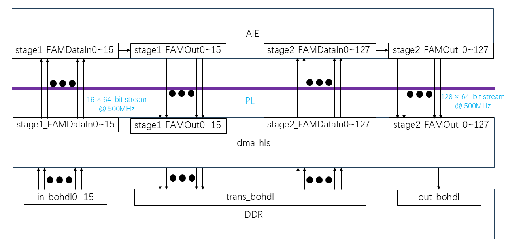

# Building the Design


```
make all
```


## HLS PL Kernel
As shown in figure below, the processing pipeline consists of three main components:
1. **DDR (Memory Storage)**
- Stores raw input data.
- Uses `AXI Master` interface with **512-bit wide bursts**.
2. **dma_hls (Data Transfer via PL)**
- Reads `8 × 64-bit` input streams from DDR.
- Transfers data to AIE using AXI streams.
- Receives `128 × 64-bit` processed outputs from AIE.
- Packs data into `1 × 512-bit` wide streams and writes back to DDR.
3. **AIE (FFT Accumulation Processing)**
- Processes `8 × 64-bit` input streams.
- Expands the data into `128 × 64-bit` output streams.

<div align="center">
    
</div>


## **Code explanation**
### **HLS Kernel: `dma_hls.cpp`**
The `dma_hls` function is the top-level HLS kernel that performs:
1. **Reading Input Data from DDR (`memin0` to `memin7`)**
- Uses `ap_uint<512>` to read **8 cfloat values** at once.
- Writes to **8 separate AXI streams (`FAMDataIn_0` to `FAMDataIn_7`)**.

2. **AIE Computation (via AXI Streams)**
- Streams **input data to AI Engine** for FFT Accumulation Processing.
- Receives **128 output streams** from AI Engine.

3. **Writing Output Data to DDR (`memout`)**
- Reads **128 output streams (`FAMOut_0` to `FAMOut_127`)**.
- Packs data into `ap_uint<512>` to perform **high-bandwidth writes**.
- Uses loop optimizations for efficient memory access.

### **AXI Interface Configuration**
```cpp
#pragma HLS INTERFACE m_axi offset=slave bundle=gmem0 port=memin0 max_read_burst_length=16 num_read_outstanding=64
#pragma HLS INTERFACE axis port=FAMDataIn_0
#pragma HLS INTERFACE axis port=FAMOut_0
#pragma HLS PIPELINE II=1
```
- Uses **AXI Master (`m_axi`)** for memory accesses.
- Uses **AXI Stream (`axis`)** for fast data movement.
- Applies **loop pipelining** to maximize throughput.

---

### **Performance Metrics**
| Metric               | Value                 |
|----------------------|----------------------|
| **Input Data Rate**  | `8 × 64-bit @ 500MHz` |
| **Output Data Rate** | `128 × 64-bit @ 500MHz` |
| **Memory Write Rate** | `1 × 512-bit @ 500MHz` |

---


## Next Steps

After compiling the PL datamover kernels, we are ready to link the entire hardware design together in the next module, [Module 04 - Hardware Link](../Module_04_hw_link).

