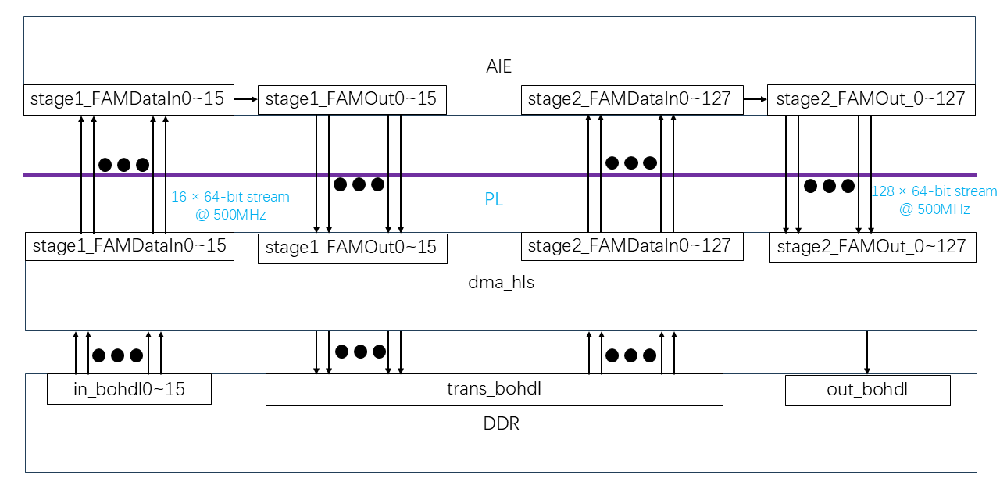

# Building the Design


```
make all
```


## HLS PL Kernel
As shown in figure below, the processing pipeline consists of three main components:

- **DDR is used as the data source** to store input data `in_bohdl0~15`, and the data is transmitted to PL (FPGA programmable logic) through **16 × 64-bit streams @ 500MHz**.
- **PL transmits data to AIE through AXI-Stream**, and inputs the data to `stage1_FAMDataIn0~15` for the first stage calculation.
- **After AIE (stage 1) calculation is completed**, the result data `stage1_FAMOut0~15` is transmitted back to PL.
- **PL stores the first stage calculation result in `trans_bohdl`** of DDR as an intermediate buffer.
- **PL reads `trans_bohdl` and reformats the data**, converting it into **128 × 64-bit streams @ 500MHz**, and then transmits it to AIE (stage 2) `stage2_FAMDataIn0~127`.
- **After AIE (stage 2) calculation**, output `stage2_FAMOut_0~127` is sent back to PL.
- **PL writes the second stage calculation result to DDR (`out_bohdl`)** for further storage or transmission.

<div align="center">
    
</div>


## **Code explanation**
### **HLS Kernel: `dma_hls.cpp`**

1. **Data is read from DDR and transferred to AIE (stage 1)**
- The code defines the `readDDR_to_AIE1()` function to read 64-bit data from multiple DDR memory blocks (`memin0` to `memin15`) and write it to the input stream of AIE stage1 (`stage1_FAMDataIn_x`) through AXI-Stream.

2. **Data is output from AIE (stage 1) and stored in the DDR intermediate buffer (`memtrans`)**
- `readAIE1_to_memtrans()` reads the output stream of AIE stage1 and stores it in the intermediate buffer (`memtrans`).

3. **Read data from intermediate buffer (`memtrans`) and transfer to AIE (stage 2)**
- `plTranspose_to_aie2()` rearranges `memtrans` data and writes to the input stream of AIE stage2 (`stage2_FAMDataIn_x`).

4. **Read data from AIE (stage 2) and write back to DDR**
- `aie2_to_ddr()` reads the output stream of AIE stage2 (`stage2_FAMOut_x`), reassembles it into 512-bit data blocks, and finally writes `memout` to store in DDR.


### **Performance Metrics**
| Metric               | Value                 |
|----------------------|----------------------|
| **Input Data Rate**  | `8 × 64-bit @ 500MHz` |
| **Output Data Rate** | `128 × 64-bit @ 500MHz` |
| **Memory Write Rate** | `1 × 512-bit @ 500MHz` |

---


## Next Steps

After compiling the PL datamover kernels, we are ready to link the entire hardware design together in the next module, [Module 04 - Hardware Link](../Module_04_hw_link).

